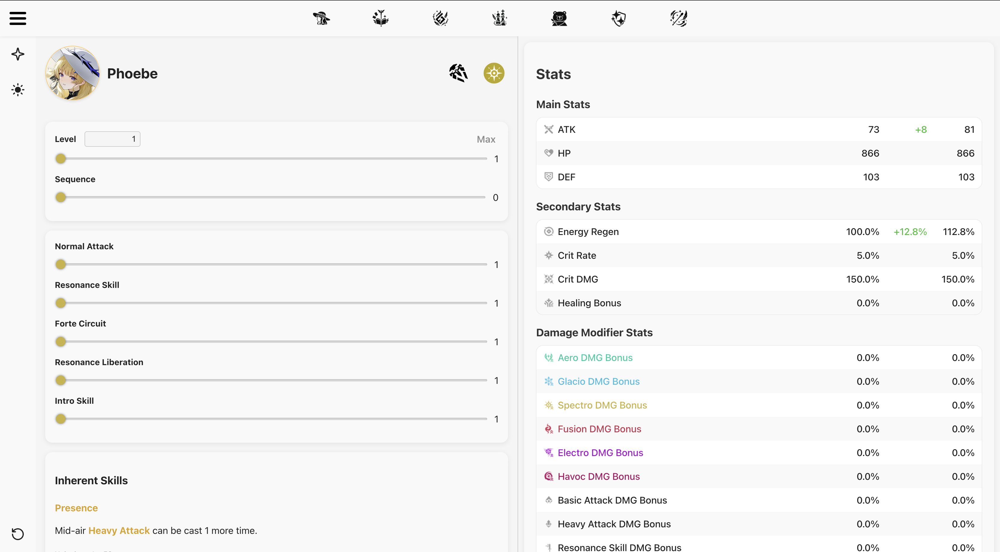

<h2 align="center">The Wuwa Calculator</h2>

<strong>A fully-featured web app to simulate and optimize character damage in <em>Wuthering Waves</em>.</strong>

  

---

### Live App

<ul>
  <li><strong>App:</strong> <a href="https://www.thewuwacalculator.com/">https://www.thewuwacalculator.com/</a></li>
  <li><strong>More (somewhat relevant) Info:</strong> <a href="https://www.thewuwacalculator.com/info">https://www.thewuwacalculator.com/info</a></li>
</ul>

---

### Contact

Have ideas, found a bug, or just want to hang out?

Join the Discord:  
<a href="https://discord.gg/8Zs8mX5z">https://discord.gg/wNaauhE4uH</a>

---

  <em>Made with love for theorycrafters and min-maxers ❤️ (myself)</em>

